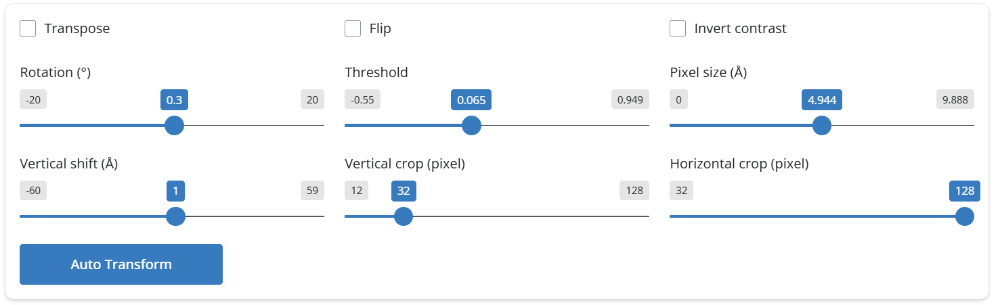
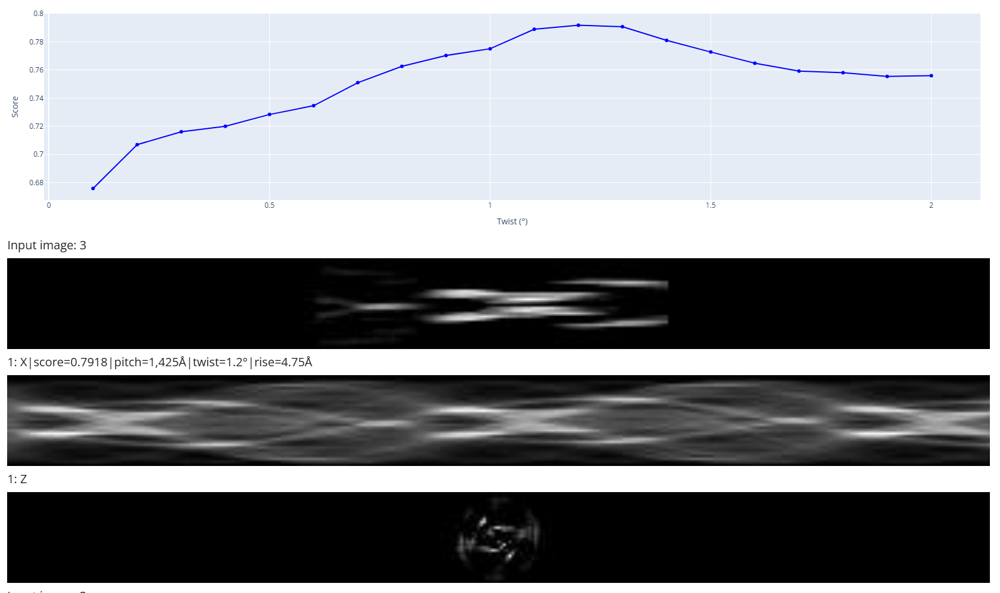

Tutorial of denovo3D
=====

This is the tutorial of the denovo3D. In this section, we will go through the pipeline of the denovo3D with several examples, 
from the 2D class average image with short pitch to the image that does not include the whole pitch information. 

.. _BasicDataset3D:

2D class deposited in the EMPIAR-10940 dataset
------------

1. (optional) Download the 2D class average from the EMPIAR-10940 dataset

.. code-block:: bash
    
    wget https://ftp.ebi.ac.uk/empiar/world_availability/10940/data/EMPIAR/Class2D/768px/run_it020_classes.mrcs

2. Run the denovo3D helicon with the following command:

.. code-block:: bash
    
    helicon denovo3D

3. There is an option to select "How to obtain the input image", one can upload the 2D class average image just downloaded or select the 
URL and put the following URL:

.. code-block:: bash
    
    https://ftp.ebi.ac.uk/empiar/world_availability/10940/data/EMPIAR/Class2D/job010/run_it020_classes.mrcs

4. Select an image on the left panel.

5. On the right side, there is a transform panel, one can either click the 'Auto transform' button to automatically transform the image, 
or manually adjust the parameters in the transform panel. One need to make sure that the helical image is aligned with the equitor line.
Like the following image:

6. Select the searching range for the helical rise and twist.

7. Click the 'Run' button to start the denovo3D analysis.

8. After the analysis is done, the results will be displayed in the right panel. The results is a 2D curve
if the twist or the rise is fixd. It will be a heat map if both twist and rise need to be searched. Below is an 
example of the result:

The upper panel shows the 2D curve of the searched twist. The lower panel shows the reconstruction result with 
the best twist value.

Low twist 2D class average image
----------------

1. Download the 2D class average from the zenodo:

.. code-block:: bash
    
    wget https://zenodo.org/api/records/15800626

2. Unzip the downloaded file:
.. code-block:: bash

    unzip ./helicon.zip

3. Run the denovo3D helicon with the following command:
.. code-block:: bash
    
    helicon denovo3D

4. On the left panel, there is a tab to change the parameters.

5. Click the 'Paramters' and change the L1 regularization ratio to 1 to only use the L1 regularization. 
The default value is 0.5, which means that L1 and L2 regularization have the equal weight.

6. Select the image on the left panel.

7. On the right side, there is a transform panel, one can either click the 'Auto transform' button to automatically transform the image,
or manually adjust the parameters in the transform panel. One need to make sure that the helical image is aligned with the equitor line.

8. Select the searching range for the helical rise and twist.

9. Click the 'Run' button to start the denovo3D analysis.

10. After the analysis is done, the results will be displayed in the right panel. The estimated helical parameter and 
the reconstruction result will be shown. 