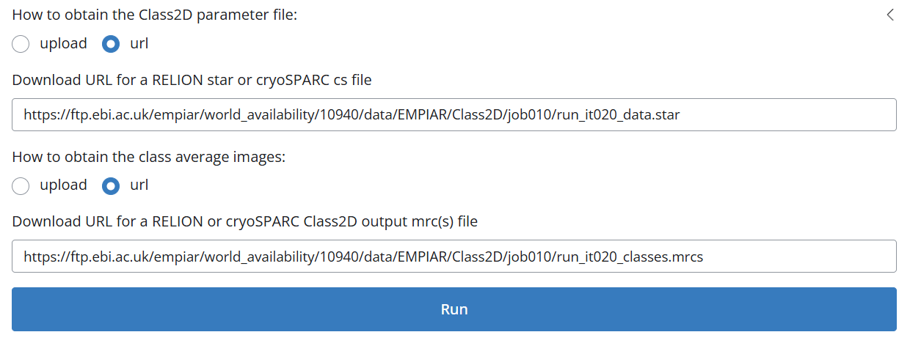
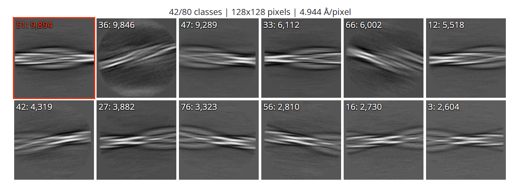
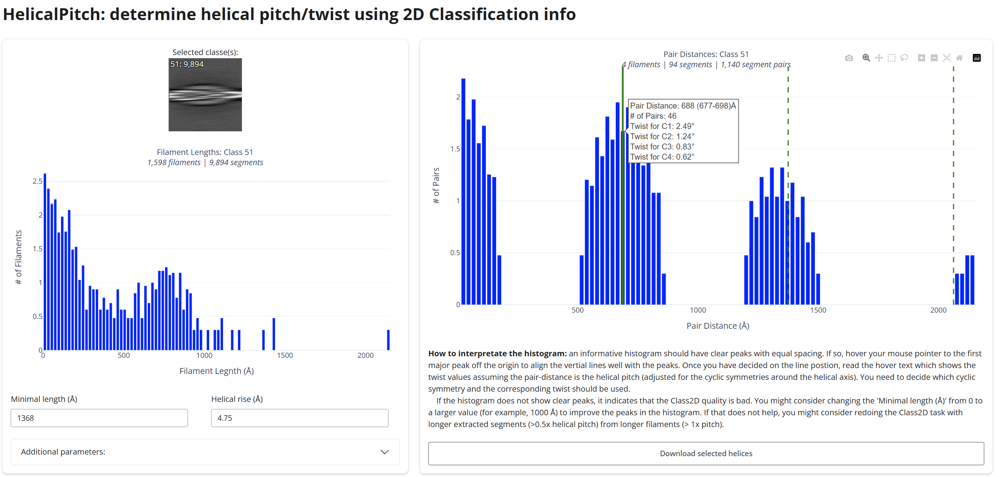

Tutorial of helicalPitch
=====

This is the tutorial of the helicalPitch. In this section, we will go through the pipeline of the helicalPitch with several examples, 
from the 2D class average image with short pitch to the image that does not include the whole pitch information. 

.. _BasicDatasethelicalPitch:

star file of the 2D classification result from the EMPIAR 10940 dataset
------------

1. (optional) Download the 2D class average from the EMPIAR-10940 dataset

.. code-block:: bash
    
    wget https://ftp.ebi.ac.uk/empiar/world_availability/10940/data/EMPIAR/Class2D/768px/run_it020_classes.mrcs
    wget https://ftp.ebi.ac.uk/empiar/world_availability/10940/data/EMPIAR/Class2D/768px/run_it020_data.star

2. Run the denovo3D helicalPitch with the following command:

.. code-block:: bash
    
    helicon helicalPitch

3. Input your 2D class average and star files 

4. Select one or multiple images and then click run_it020_classes

5. Analyze the result:

As shown above, this results could indicates the potential pitch value. The user should hover the mouse on one 
of the peak and make sure that all the other peaks are indicated by the dashed line. The hovered text would show
the user the twist value under all the possible symmetries. If the user is not satisfied with the results, the user
could increase the minimal length of the filament to be included. This will sometime improve the results. This program
is mainly designed for the amyloid protein. For other type of helical assemblies structure, one should change the default
rise value. 